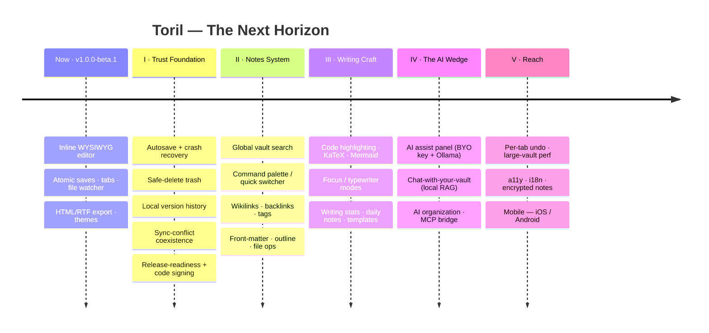

# Toril

> **The bull, penned.** A MarkText-style WYSIWYG markdown editor — your markdown
> renders *in place* as you type, with no separate preview pane.

Toril is a small, fast desktop markdown editor built on **Tauri 2 + TypeScript +
Milkdown**. Files are plain `.md` in ordinary folders, so a workspace can be a
live Obsidian vault — no proprietary container, no lock-in.

<p align="center">
  
</p>

**Primary platform: Windows.** macOS and Linux build from the same stack but are
not the current focus.

> ⚠️ **Status: beta.** The core editor and the surrounding workflow are in place
> (build phases 0–3 complete; phase 4 polish in progress). Prebuilt installers are
> available in
> **[v1.0.0-beta.1](https://github.com/kovirlabs/toril/releases/latest)** — it's
> still pre-1.0 in spirit, so expect the occasional rough edge and keep backups of
> important notes.

---

## Features

- **Inline WYSIWYG** — CommonMark + GitHub Flavored Markdown (tables, task lists,
  strikethrough, footnotes) + emoji shortcodes, rendered in place as you type.
- **HTML as a first-class format** — open, edit, and save `.html`/`.htm` documents
  WYSIWYG alongside `.md`, with the markup sanitized on load.
- **Atomic saves** — every write is temp-file + fsync + rename, so a crash
  mid-save can never corrupt an existing note.
- **Workspace sidebar + multi-document tabs** with an external-change file watcher
  (so editing a folder that's also an Obsidian vault stays in sync).
- **Session memory** — reopens your last folder and files on launch.
- **Themes** — System / Light / Dark.
- **Export** to HTML and RTF.
- **Clipboard image paste** — pasted images are saved beside the document.
- **Formatting toolbar, status bar** (word/char count + reading time), and a
  native app menu.
- **Quality-of-life** — Find & Replace, Save All, toggle sidebar, an
  unsaved-changes close guard, and opening files via double-click / "Open with".

> Not yet: Math (KaTeX), PDF export, and in-editor YAML front matter — see
> [CLAUDE.md](./CLAUDE.md) for the current status of each.

---

## Download

Prebuilt installers for the latest beta are on the
**[releases page](https://github.com/kovirlabs/toril/releases/latest)**. Grab the
one for your platform:

| Platform | Download |
|---|---|
| **Windows** | [`Toril_1.0.0-beta.1_x64-setup.exe`](https://github.com/kovirlabs/toril/releases/download/v1.0.0-beta.1/Toril_1.0.0-beta.1_x64-setup.exe) |
| **macOS** (Apple Silicon) | [`Toril_1.0.0-beta.1_aarch64.dmg`](https://github.com/kovirlabs/toril/releases/download/v1.0.0-beta.1/Toril_1.0.0-beta.1_aarch64.dmg) |
| **macOS** (Intel) | [`Toril_1.0.0-beta.1_x64.dmg`](https://github.com/kovirlabs/toril/releases/download/v1.0.0-beta.1/Toril_1.0.0-beta.1_x64.dmg) |
| **Linux** (AppImage) | [`Toril_1.0.0-beta.1_amd64.AppImage`](https://github.com/kovirlabs/toril/releases/download/v1.0.0-beta.1/Toril_1.0.0-beta.1_amd64.AppImage) |
| **Linux** (Debian/Ubuntu) | [`Toril_1.0.0-beta.1_amd64.deb`](https://github.com/kovirlabs/toril/releases/download/v1.0.0-beta.1/Toril_1.0.0-beta.1_amd64.deb) |
| **Linux** (Fedora/RHEL) | [`Toril-1.0.0-beta.1-1.x86_64.rpm`](https://github.com/kovirlabs/toril/releases/download/v1.0.0-beta.1/Toril-1.0.0-beta.1-1.x86_64.rpm) |

Prefer to compile it yourself? See [Building from source](#running-from-source-development).

## Installing on Windows

Download **`Toril_1.0.0-beta.1_x64-setup.exe`** above and double-click it. It
performs a per-user install — no administrator rights needed:

- Copies the app into **`%LOCALAPPDATA%\Toril`** (i.e.
  `C:\Users\<you>\AppData\Local\Toril`) — no admin prompt.
- Adds a **Start Menu** entry, and offers a **Desktop shortcut** checkbox during
  setup.
- Registers an entry in **Apps & features** for clean uninstallation.

> **SmartScreen note:** the build is unsigned, so on first run Windows
> SmartScreen may warn "Windows protected your PC." Click **More info →
> Run anyway**. This is expected for an unsigned personal build, not a problem
> with the app.

### Uninstalling

Use **Settings → Apps → Installed apps → Toril → Uninstall**, or run the
uninstaller in `%LOCALAPPDATA%\Toril`.

## Installing on macOS / Linux

- **macOS:** open the `.dmg` and drag **Toril** to Applications. The build is
  unsigned, so the first launch needs **right-click → Open** (or *System Settings
  → Privacy & Security → Open Anyway*) to get past Gatekeeper.
- **Linux:** the `.AppImage` is portable — `chmod +x Toril_1.0.0-beta.1_amd64.AppImage`
  and run it. Or install the `.deb`
  (`sudo apt install ./Toril_1.0.0-beta.1_amd64.deb`) / `.rpm`
  (`sudo dnf install ./Toril-1.0.0-beta.1-1.x86_64.rpm`).

---

## Roadmap

> **The bull, penned — now learning to roam.** Toril is a solid single-document
> editor today; the plan is to grow it into a notes **system** you live in: the
> local-first, plain-files, AI-native writing tool you defect to when you outgrow
> Apple Notes.

The work is organized into five movements, sequenced by one rule — **trust before
reach**: the data-safety floor ships before the differentiators, and the AI layer
stands on top of it.



| Movement | Focus | Milestone |
|---|---|---|
| **I — Trust Foundation** | Make it safe to live in | *"Safe to live in"* |
| **II — Notes System** | The daily-driver core | *"A real notes system"* — first beta |
| **III — Writing Craft** | Win the focus-writer fight | *"A joy to write in"* |
| **IV — The AI Wedge** | The unfair advantage | *"Your notes, with Claude inside"* |
| **V — Reach** | Scale, polish, and the mobile bet | **v1.0** — *"for everyone who outgrew their notes app"* |

The full branch-by-branch plan — goals, gates, new crates, and open decisions —
lives in **[ROADMAP.md](./ROADMAP.md)**.

---

## Running from source (development)

To run the app live with hot-reload instead of installing:

```powershell
pnpm install
pnpm tauri dev
```

The first run compiles the Rust backend, so it takes a while; subsequent runs are
fast.

### Building on macOS / Linux

The same `pnpm tauri build` works, with platform build dependencies:

- **macOS:** Xcode Command Line Tools (`xcode-select --install`).
- **Linux:** WebKitGTK and friends, e.g. on Debian/Ubuntu:
  ```bash
  sudo apt install libwebkit2gtk-4.1-dev build-essential curl wget file \
    libxdo-dev libssl-dev libayatana-appindicator3-dev librsvg2-dev pkg-config
  ```

---

## Development reference

| Task | Command |
|---|---|
| Run the app (dev) | `pnpm tauri dev` |
| Build app + installers | `pnpm tauri build` |
| Frontend type-check | `pnpm typecheck` |
| Frontend build only | `pnpm build` |
| Frontend tests (round-trip, tabs) | `pnpm test` |
| Backend logic tests | `cd src-tauri && cargo test -p fsatomic -p vaultscan -p mdhtml -p mdrtf -p imgasset` |

The architecture, data-safety rules, command contract, and build milestones live
in **[CLAUDE.md](./CLAUDE.md)**; the forward plan (branch-by-branch, with adoption
guidance) in **[ROADMAP.md](./ROADMAP.md)**; brand and theming in
**[BRAND.md](./BRAND.md)**.
