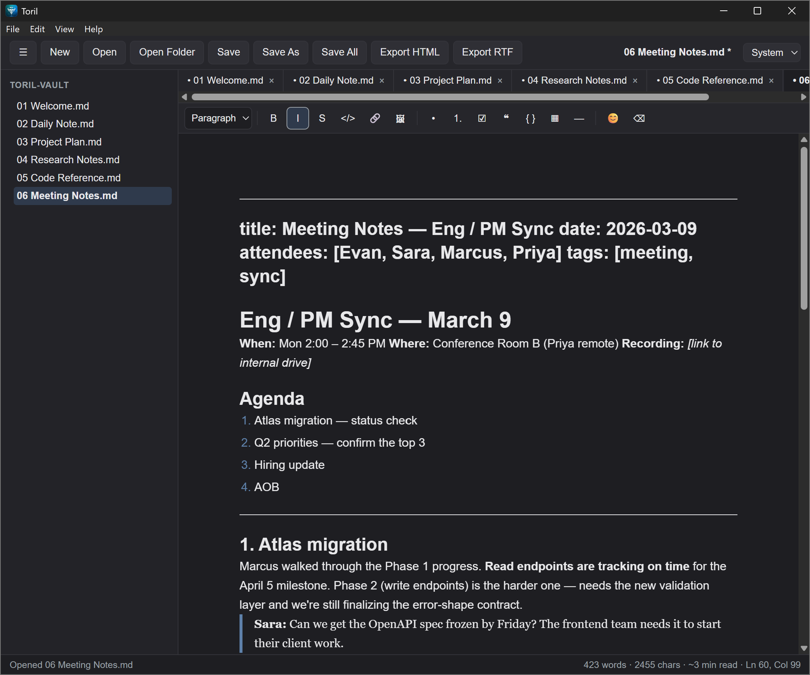

# Toril

Toril is a desktop markdown editor. Your markdown renders in place as you type —
there is no separate preview pane — and your files stay plain `.md` in ordinary
folders, so a workspace can be a live Obsidian vault.

It is built on Tauri 2, TypeScript, and Milkdown. The primary platform is
**Windows**; macOS and Linux build from the same stack and get less testing.

<p align="center">
  
</p>

> **Status: 1.0.** The editor and the workflow around it work, and your notes stay
> plain files you can walk away with. Installers:
> **[v1.0.0](https://github.com/kovirlabs/toril/releases/latest)**.
>
> Keep backups of anything important, as with any editor. See
> [CHANGELOG.md](./CHANGELOG.md) for what each release changed.

---

## What it does

This is what the current installer gives you.

- **Inline WYSIWYG editing** — CommonMark and GitHub Flavored Markdown (tables,
  task lists, strikethrough, footnotes), plus emoji shortcodes, rendered as you
  type.
- **HTML as a first-class format** — open, edit, and save `.html`/`.htm`
  documents in the same editor, sanitized on load.
- **Atomic saves** — every write is temp-file, fsync, then rename. A crash
  mid-save cannot corrupt an existing note.
- **Workspace sidebar and multi-document tabs**, with a file watcher that
  notices changes made outside the editor.
- **Session memory** — reopens your last folder and files.
- **Export** to HTML and RTF.
- **Clipboard image paste** — pasted images are written beside the document.
- **Themes** (System / Light / Dark), a formatting toolbar, a status bar with
  word and character count, and a native menu.
- **Find and Replace, Save All**, an unsaved-changes guard on close, and opening
  files by double-click or "Open with".

## What it doesn't do

Some of this is deliberate and permanent; some is just not built yet. The
distinction matters, so they are listed separately.

**By design:**

- No account, no cloud sync, no backend, no telemetry. Toril does not phone home.
- No proprietary container or sidecar database — stop using Toril tomorrow and
  every note is still a `.md` file you can open in anything.
- No plugin system, and no plans for one.
- No mobile app.

**Not yet built:**

- Math rendering (KaTeX), PDF export, and in-editor YAML front matter.
- Global search across a vault, wikilinks, and backlinks.
- Signed installers, so Windows SmartScreen and macOS Gatekeeper warn on first
  run. That is expected for an unsigned build, not a sign of a problem.

---

## Download

Installers are on the
**[releases page](https://github.com/kovirlabs/toril/releases/latest)**.

| Platform | Download |
|---|---|
| **Windows** | [`Toril_1.0.0_x64-setup.exe`](https://github.com/kovirlabs/toril/releases/download/v1.0.0/Toril_1.0.0_x64-setup.exe) |
| **macOS** (Apple Silicon) | [`Toril_1.0.0_aarch64.dmg`](https://github.com/kovirlabs/toril/releases/download/v1.0.0/Toril_1.0.0_aarch64.dmg) |
| **macOS** (Intel) | [`Toril_1.0.0_x64.dmg`](https://github.com/kovirlabs/toril/releases/download/v1.0.0/Toril_1.0.0_x64.dmg) |
| **Linux** (AppImage) | [`Toril_1.0.0_amd64.AppImage`](https://github.com/kovirlabs/toril/releases/download/v1.0.0/Toril_1.0.0_amd64.AppImage) |
| **Linux** (Debian/Ubuntu) | [`Toril_1.0.0_amd64.deb`](https://github.com/kovirlabs/toril/releases/download/v1.0.0/Toril_1.0.0_amd64.deb) |
| **Linux** (Fedora/RHEL) | [`Toril-1.0.0-1.x86_64.rpm`](https://github.com/kovirlabs/toril/releases/download/v1.0.0/Toril-1.0.0-1.x86_64.rpm) |

<details>
<summary><b>Installing on Windows</b></summary>

**1. Download** `Toril_1.0.0_x64-setup.exe` from the table above.

**2. Unblock it if Windows marked it.** Files downloaded from the internet carry
a "mark of the web". If the installer refuses to start, right-click it →
**Properties** → tick **Unblock** at the bottom → **OK**.

**3. Run the installer.** It installs per-user, so there is no administrator
prompt. It copies the app into `%LOCALAPPDATA%\Toril`, adds a Start Menu entry,
offers a Desktop shortcut during setup, and registers in **Apps & features** for
clean uninstallation. Because the install is per-user, other accounts on the same
PC will not see Toril.

**4. Get past the unsigned-build warning.** The build is not code-signed, so
Windows objects on first run. Which warning you get depends on your settings:

- **SmartScreen** — "Windows protected your PC". Choose **More info → Run
  anyway**.
- **Smart App Control** — on Windows 11 24H2 and later this can *block* the
  installer outright, with no "Run anyway" to click. If that happens, the only
  way through is to turn Smart App Control off in **Windows Security → App &
  browser control → Smart App Control settings**. Decide deliberately: once it
  is off, Windows will not let you turn it back on without reinstalling.

Both are expected for an unsigned build, not a sign of a problem. Signed
installers are on the roadmap.

**5. Optional — make Toril your default Markdown editor.** Setup registers
`.md`, `.markdown`, `.html`, and `.htm`, but Windows 11 no longer shows a
one-click "always use this app" prompt, so registering is not the same as
becoming the default. To set it: **Settings → Apps → Default apps** → search for
`Toril` → choose each file type you want it to own. Or right-click any `.md`
file → **Open with → Choose another app** → Toril → **Always**.

**To uninstall:** **Settings → Apps → Installed apps → Toril → Uninstall**, or
run the uninstaller in `%LOCALAPPDATA%\Toril`.

</details>

<details>
<summary><b>Installing on macOS and Linux</b></summary>

**macOS:** open the `.dmg` and drag Toril to Applications. The build is unsigned,
so the first launch needs **right-click → Open** (or *System Settings → Privacy &
Security → Open Anyway*).

**Linux:** the AppImage is portable —
`chmod +x Toril_1.0.0_amd64.AppImage` and run it. Or install the `.deb`
(`sudo apt install ./Toril_1.0.0_amd64.deb`) or `.rpm`
(`sudo dnf install ./Toril-1.0.0-1.x86_64.rpm`).

</details>

---

## Where it's going

Current work is a data-safety floor: autosave and crash recovery, version
history, safe delete, and coexisting cleanly with folders that Obsidian or a sync
client is also writing to. The features that make it a notes system — vault
search, wikilinks, backlinks — come after that, on the principle that a tool you
keep notes in has to be trustworthy before it is clever.

An AI assist layer is planned further out, built around your own API key or a
local model. None of it is written yet, and nothing in Toril talks to a network
today.

The branch-by-branch plan is in **[ROADMAP.md](./ROADMAP.md)**.

---

## Building from source

You need these on every platform, before anything else:

- **Rust** (stable), via [rustup](https://rustup.rs).
- **Node.js** LTS.
- **pnpm**, enabled through Corepack — `corepack enable pnpm`. Toril pins its
  dependencies through the pnpm lockfile, and `pnpm install` is what applies the
  patch in `patches/`, so npm and yarn are not substitutes.

Then:

```bash
pnpm install
pnpm tauri dev      # run with hot reload
pnpm tauri build    # produce installers
```

The first run compiles the Rust backend and takes a while; later runs are fast.

Platform build dependencies:

- **Windows:** [Microsoft C++ Build Tools](https://visualstudio.microsoft.com/visual-cpp-build-tools/)
  with the **Desktop development with C++** workload ticked — the default
  download does not include it, and without it the Rust link step fails. Plus the
  WebView2 runtime, which is preinstalled on Windows 11 and bootstrapped by the
  installer on Windows 10.
- **macOS:** Xcode Command Line Tools (`xcode-select --install`).
- **Linux:**
  ```bash
  sudo apt install libwebkit2gtk-4.1-dev build-essential curl wget file \
    libxdo-dev libssl-dev libayatana-appindicator3-dev librsvg2-dev pkg-config
  ```

## Development reference

| Task | Command |
|---|---|
| Run the app | `pnpm tauri dev` |
| Build app and installers | `pnpm tauri build` |
| Frontend tests | `pnpm test` |
| Type-check | `pnpm typecheck` |
| Frontend build only | `pnpm build` |
| Backend logic tests | `cd src-tauri && cargo test -p fsatomic -p vaultscan -p mdhtml -p mdrtf -p imgasset -p trashbin -p snapshots -p mergemd -p keystore` |
| Formatting and lints | `cd src-tauri && cargo fmt --all && cargo clippy` |

CI runs the frontend suite, the type-check, the build, and the backend logic
tests on Ubuntu and Windows for every pull request. The Rust logic crates are
deliberately kept out of the app crate so they build and test without a system
webview.

[CONTRIBUTING.md](./CONTRIBUTING.md) covers setup and the rules a change has to
follow. [CLAUDE.md](./CLAUDE.md) is the authoritative design document —
architecture, the data-safety contract, and the backend command contract.
[SECURITY.md](./SECURITY.md) covers the threat model and how to report a
vulnerability.

---

## The name

In Spanish bullfighting, *el toril* is the pen where the bull waits before it
charges into the ring — a nod to Tauri (the bull) and to writing (the pen), with
the bull-in-a-china-shop joke built in. The editor is the bull, safely penned,
doing delicate work. Brand and theming notes are in [BRAND.md](./BRAND.md).

## License

[Apache License 2.0](./LICENSE). Contributions are welcome and there is no CLA —
see [CONTRIBUTING.md](./CONTRIBUTING.md).
